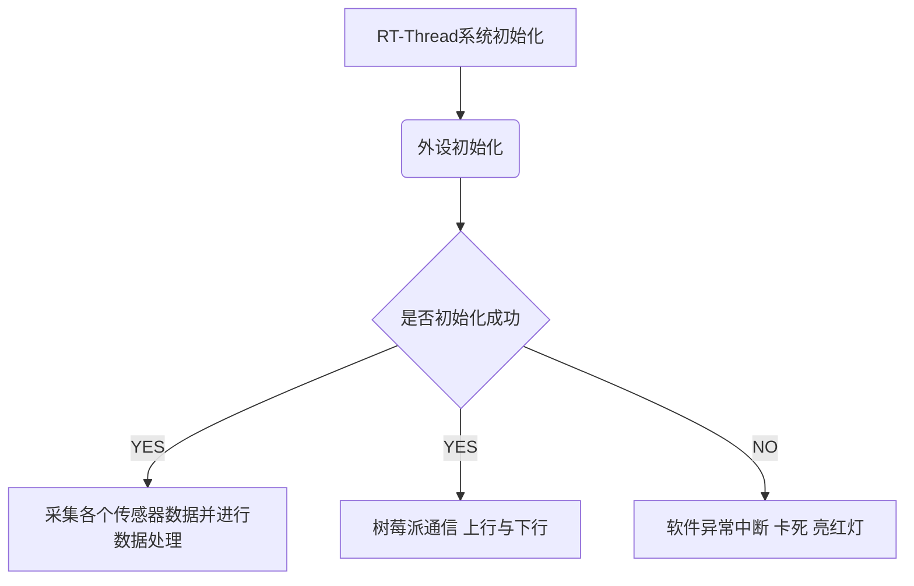

# 1、ROV/AUV航行器控制中心


[个人主页🕺](https://zengwangfa.top/) |
[软件说明💻](./software/README.md) |
[硬件说明📚](./hardware/README.md) |
[机械结构说明🎮](./graphic_model/README.md)


### 简介
[](https://996.icu/#/en_US)


---

| 硬件 | 描述 |
| -- | -- |
|芯片型号| STM32F407ZGT6 |
|CPU| Cortex-M4 |
|主频| 168MHz |
|FLASH| 1MB |
|SRAM| 192KB |
|单元| FPU、DSP |

- 系统架构简图：


## 2、目录说明
```
+——Underwater_vehicle
|--------+ docs: 【设计参考文档】
|--------+ hardware:【相关电路设计】      
|            ├──README.md
|            ├──.SchDoc
|            ├──.PcbDoc
|            └──.pdf
|--------+ software:【相关软件设计】
|            ├──README.md
|            ├──rt-thread-master
|                 └──bsp
|                    └──stm32f40x 【主要系统控制程序】
|--------+ graphic_model:【机械模型】
|--------+ raspberry_server:【树莓派服务】
|--------+ README.md
```

## 3、机械结构

- 3维模型


- 实物图


## 4、软件结构




- 💻 🎮 Computer Connect【C#】--Ethernet - Optical Fiber -- Ethernet--> Raspberry Pi【Python】 ---> MCU Control 【C】


## 5、硬件结构


- 核心板(Core Controller)拥有外设：

| 外设名称 | RGB LED | Key | Buzzer | Dial Switch | MS5837 | OLED | W25Q128 | Voltage Detection | Current Detection | Zigbee |  JY901 | USR-C216 | CP2102 | OV2640 Camera | Servo Motor | Searchlights | Perpellers |
| --- | --- | --- | --- | --- | --- | --- | --- | --- | --- | --- | --- | --- |  --- | --- |  --- |  --- | --- |
| 控制(通讯)方式 | GPIO | GPIO | GPIO | GPIO | I2C | SPI | SPI | ADC | ADC | USART | USART | USART  | USART | DCMI-DMA | PWM | PWM | PWM |
| 功能描述 | 指示灯 | 按键 | 蜂鸣器 | 拨码开关 | 深度传感器 | 显示屏 | 闪存芯片 | 电压检测 | 电流检测 | 2.4G无线通信 | 九轴 | WiFi模块 | 串口转USB | 摄像头 | 舵机  | 探照灯 | ESC |

- 树莓派拥有有外设：

| 外设名称 | Camera 1 | Camera 2 | Core Controller | PLC / Optical-to-electrical Transducer |
| --- | --- | --- | --- | --- |
| 控制(通讯)方式 | USB | USB | USB | Ethernet |
| 功能描述 | 外置光学变焦摄像头 | 内置云台摄像头 | 核心控制器 | 电力载波模块/光电转换器 | 


## 6、Underwater Vehicle 的进展
- [X] 电路设计
	- [X] Core Controller核心控制板 by [@zengwangfa](https://github.com/zengwangfa)	
	- [X] Underwater_Vehicle主板 by [@zengwangfa](https://github.com/zengwangfa)	
	- [X] 变焦摄像头驱动控制板 by [@李昕凯]
	- [X] 电源主板设计 by [@zengwangfa](https://github.com/zengwangfa)🆕
	
- [X] 控制程序
    - [X] 外设驱动 by [@zengwangfa](https://github.com/zengwangfa)
    - [X] 内置MSH方法 by [@zengwangfa](https://github.com/zengwangfa)
    - [X] debug上位机:(Vcan【山外】/Ano【匿名】) by [@zengwangfa](https://github.com/zengwangfa)
	- [X] 控制简易框架 by [@zengwangfa](https://github.com/zengwangfa)
	- [X] 通信控制 by [@zengwangfa](https://github.com/zengwangfa)🆕

- [X] 上位机
	- [X] C#上位机界面 by [@陈信任] 🆕
	- [X] 遥控器通信控制 by [@陈信任]	
	
- [X] 机械结构
	- [X] 框架式结构CAD设计 by [@林麟亮] 🆕
	- [X] 电子仓、电源仓设计 by [@林麟亮]
	- [X] 云台3D打印模型 by [@洪华霖]

- [X] 树莓派
	- [X] 数据Server服务器 by [@FatihBo](https://github.com/FatihBo)🆕


## 7、使用说明

- set_vehicle_mode <parameter> 
> 设置工作模式（auv/rov）
- propeller_dir_set <parameter parameter parameter parameter parameter parameter>
> propeller_dir_set rightUp      leftDown     leftUp     rightDown     leftMiddle    rightMiddle 设置六个推进器方向(1代表正方向，-1代表反方向)

- propeller_power_set <parameter>
> 设置推进器动力 0~300%
- set_depth_sensor_type <parameter>
> 修改深度传感器 类型<ms5737/spl1301>

#### 参与贡献

- Fork 本仓库
- 新建 Feat_xxx 分支
- 提交代码
- 新建 Pull Request

#### 个人主页

[淹死的鱼](https://zengwangfa.top/)


