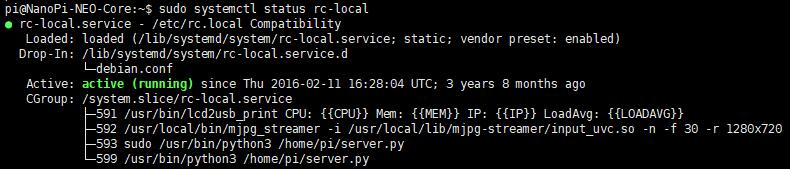
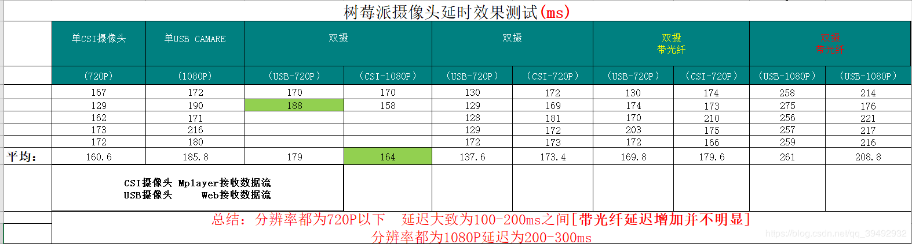

- server.py 
    - 为以树莓派作为服务器，树莓派实现接收上位机的控制数据包通过USB转发给STM32
    - 并将STM32采集到的数据【CPU温度、水深、水温、航向角、俯仰角、横滚角、航速、提示字符等】回传给上位机
- rc.local 
	- 以自启动服务方式开启python服务端（用于收发指令、传递数据）
	- 以自启动服务方式开启MJPG-Streamer推送视频流
	
# 1.MJPG-Streamer安装
[MJPG-Streamer安装与推流](https://blog.csdn.net/qq_39492932/article/details/84671345)
	
	
# 2.自启动方式
- 一、系统脚本式自启动(推荐)
- 二、桌面式自启动

## 2.1 系统脚本式自启动

- 1.将/etc/rc.local中的rc.local替换掉（如果需要多个摄像头，）
- 2.server.py 放 /home/pi 下

- 3.shell输入：
`
sudo chmod +x /etc/rc.local
`
使脚本生效（可执行）

---
- 当发现rc.local中的服务**并未自启动**，输入命令： `sudo systemctl status rc-local` 可以检查服务状态（正常状态如下图），如未启动可根据提示的**报错信息**进行相应的修改

## 2.2 桌面式启动器	
- 1.server.py 放 /home/pi 下
- 2.autostart文件夹为 放置在树莓派 /home/pi/.config 文件夹下 **实现开机自启动**【树莓派服务器】以及【MJPG视频推流】
	- Server.desktop :【树莓派服务器】
    - MJPG0.desktop :【MJPG视频0推流】
	- MJPG1.desktop :【MJPG视频1推流】
> 只有当桌面打开,该服务程序才会打开

## 3.延迟测试
- 硬件平台：树莓派3B+（粗略测试）

